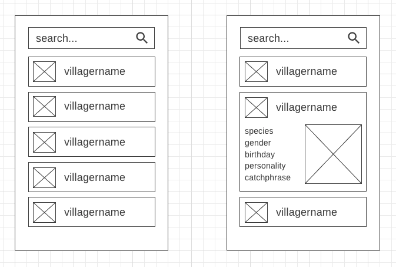
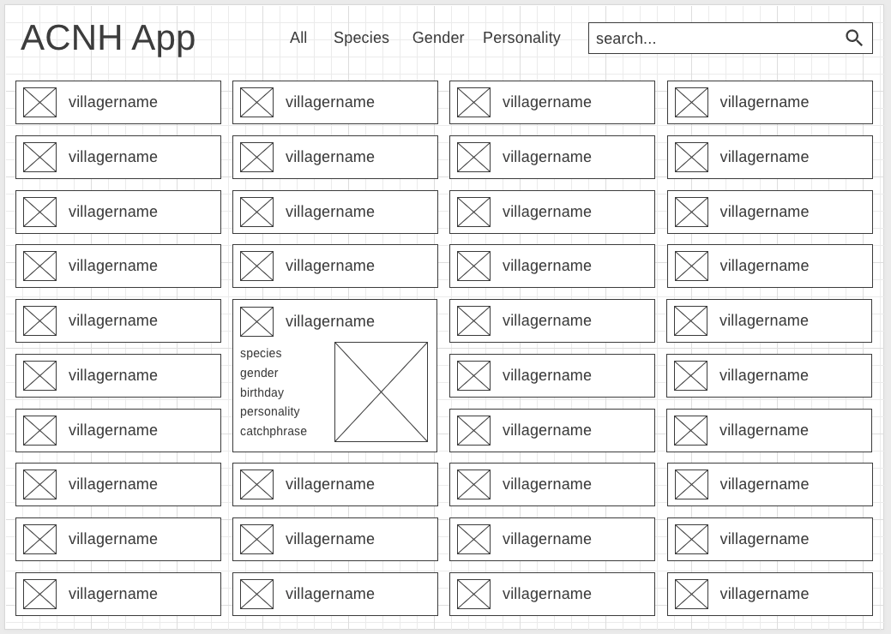

# Animal Crossing: New Horizons Guide
A web application to display information about Animal Crossing: New Horizons villagers, catchable critters, and collectible items. 

## Technologies Used
* HTML
    * Form inputs
    * Multi-level Nav
* CSS
    * Responsive Design
    * Flexbox
    * Grid
* JavaScript
* jQuery
    * DOM Manipulation
* Animal Crossing API
    * AJAX

## Features
* Browse all villagers or browse by species, gender, or personality
* Browse catchable bugs, fish, and sea creatures
* Browse collectible art and fossils
* Search for any villager, bug, fish, sea creature, artwork, or fossil
## Wireframes

## Future Goals
* Use `localstorage` to allow the user to save favorite villagers and items
* Add a section for NPC characters